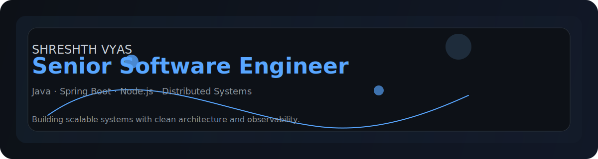
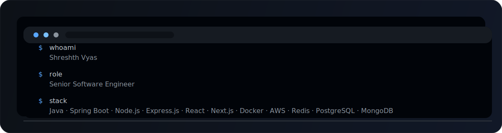
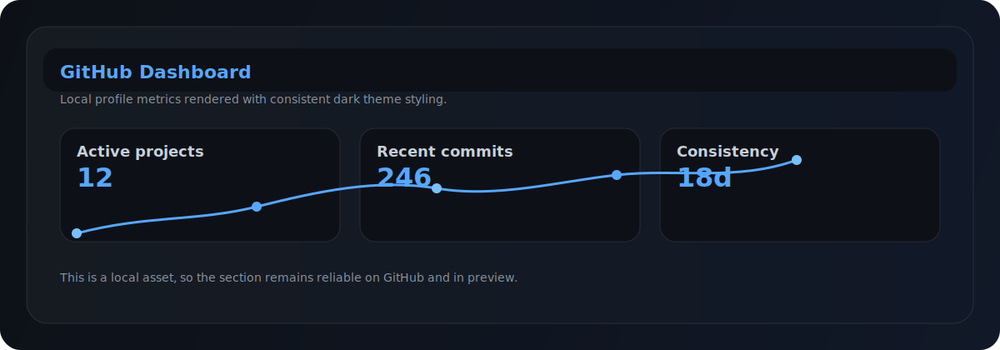
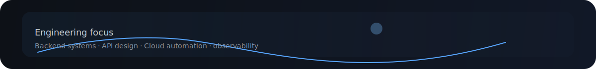

<!--
  Profile repository designed for recruiters and senior engineers.
  Why it exists: showcase backend engineering, architecture, and clean systems thinking.
  How to edit: update the named sections below and keep the terminal, skills, and philosophy concise.
  Customize: change the text, replace the assets in /assets, and update workflows in /.github/workflows.
-->

  

 

<h1 align="center">Hi, I’m <strong>Shreshth Vyas</strong></h1>

Senior Software Engineer • Java | Spring Boot | Node.js | Distributed Systems

  Building scalable backend systems with clean architecture, observability, and strong API design.

  

<!-- Terminal section: clean Linux-style system view for identity and focus -->
## Terminal

  

  

<!-- Skills section: direct, readable, recruiter-friendly categories -->
## Skills

- **Languages:** Java · JavaScript · TypeScript · SQL
- **Backend:** Spring Boot · Spring Security · Node.js · Express.js · REST APIs · JWT · OAuth · Hibernate · JPA · Microservices
- **Databases:** PostgreSQL · MySQL · MongoDB · Redis
- **Cloud & DevOps:** Docker · AWS · Linux · GitHub Actions
- **Architecture:** SOLID · Design Patterns · Caching · System Design · Scalability · Authentication · Authorization · Rate Limiting · Clean Architecture · REST Principles

  

<!-- Architecture section: communicates the engineering focus with concise domain areas -->
## Architecture

- System design for reliability, latency, and throughput
- Service boundaries, observability, and operational readiness
- API-first design, security-first authentication, and resilient error handling
- Automation of CI/CD, infrastructure, and service delivery

  

<!-- Learning section: show commitment to growth in technical systems -->
## Currently Learning

- Distributed Systems
- Kafka
- Kubernetes
- Observability
- Event Driven Architecture

  

<!-- GitHub dashboard: local SVG provides a stable, polished dashboard visual -->
## GitHub Dashboard

  

  

<!-- Philosophy section: short, memorable principles for engineering excellence -->
## Engineering Philosophy

- Write code for humans.
- Keep systems simple.
- Automate repetitive work.
- Measure before optimizing.
- Build things that scale.

  

